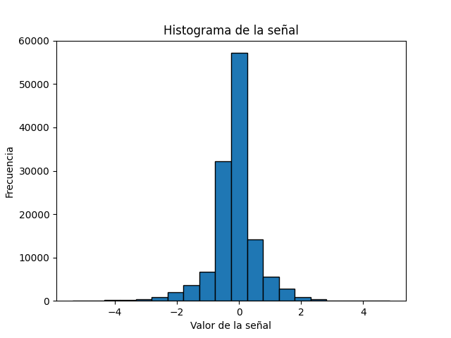
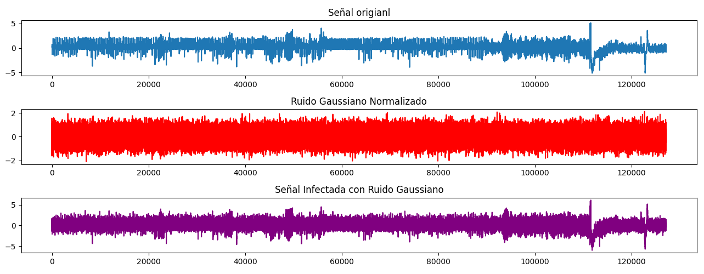
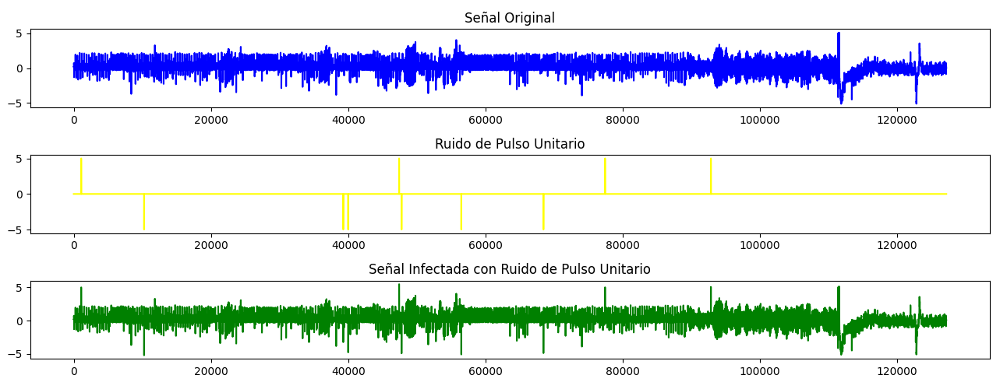

# Analisis estadistico de una señal
## Introduccion 
El laboratorio consistió en el desarrollo de un código en Python para el análisis de 
una señal fisiológica extraída de PhysioNet. El código funciona en señales individuales.
## Tratamiento de la señal y operaciones estadisticas
Lo primero que hace el código es extraer y filtrar los datos para asegurar que 
todos los valores extraídos de los archivos .dat y .hea sean numéricos y 
aritméticos. Para esto, se utilizó la librería wfdb y numpy de Python.

```python
# importar paquete wfdb para leer "records" de PhysioNet
import wfdb
import matplotlib.pyplot as plt
import numpy as np

# cargar la información (archivos .dat y .hea)
signal = wfdb.rdrecord('cu05')

# obtener valores de y en la señal 
valores = signal.p_signal

# Aplanar los valores a una dimensión
valores = valores.flatten()

# Eliminar valores NaN
valores_limpios = [x for x in valores if not np.isnan(x)]
```}

```
Una vez que se tienen los valores limpios en un vector, se procede a calcular la media (0.107), 
la desviación estándar (0.73) y el coeficiente de variación (6.83). Esto se realiza con el fin de determinar el comportamiento de la señal 
y evaluar cuán dispersos están los valores entre sí. Es importante destacar que este proceso se realiza tanto con las funciones 
básicas de Python como con funciones más complejas que se encargan de calcular estos valores de forma directa.

```python
# Función para calcular la media de los valores
def calc_media(valores):
    total=0
    for x in valores:
        total += x
    return total / len(valores)
```

```python
# Función para calcular la desviación estándar de los valores
def calc_desv(valores, media):
    suma_difcuad = 0
    for x in valores:
        suma_difcuad += (x - media) ** 2 #Sumando en un bucle
    return (suma_difcuad / len(valores)) ** 0.5
```

```python
# Función para calcular el coeficiente de variación
def calc_coe(media,desviacion):
    return desviacion/media
```
## Histograma
Posteriormente, se creó una función para generar un histograma con los valores limpios de la señal. 
Esto permite determinar la frecuencia de los valores en rangos determinados. 
En el ejemplo, se utilizaron 20 divisiones. Este proceso se realizó 
tanto usando la función de la librería matplotlib como sin ella.

```python
# Calcular histograma manualmente
min_val=min(valores_limpios)
max_val=max(valores_limpios)

nbin = 20
wbin= (max_val-min_val)/nbin

bins = [0] * nbin

# Asignar valores a bins 
for val in valores_limpios:
    binx = int((val - min_val) / wbin)
    if binx == nbin:
        binx -= 1
    bins[binx] +=1

# Crear bordes de bins para el histograma
ebin=[min_val + i * wbin for i in range (nbin +1)]

# Graficar histograma
plt.bar(ebin[:-1], bins, width=wbin, edgecolor='black') # funcion para graficar diagrama de barras
plt.xlabel('Valor de la señal')
plt.ylabel('Frecuencia')
plt.title('Histograma de la señal')
plt.show()
```
Al ejecutar el programase puede obtener el siguiente grafico:



Como se puede observar en el gráfico, este presenta una distribución normal, ligeramente sesgada hacia la derecha. 
Sin embargo, el pico de mayor frecuencia indica que la mayor parte de los valores se ubica cerca de cero en términos de amplitud.

# Ruido 
Para generar el ruido, se creó una funciones aleatorias que generan números basados en la amplitud y la cantidad de muestras de la señal que se desea contaminar. En el caso del ruido gaussiano, hay un valor por cada muestra. En este caso, la longitud del vector de valores.

```python
# Ruido Gaussiano
medrg=0
desvrg=1
rgauss=np.random.normal(medrg,desvrg,nm)

ampmax = max(abs(min_val),abs(max_val))- 3
rgaussn = rgauss/np.max(np.abs(rgauss))*ampmax

# Infectar la señal con ruido Gaussiano
sginf = valores_limpios + rgaussn 
```



Al introducir ruido gaussiano en la señal, se puede observar un aumento en la amplitud de la señal original, lo que distorsiona y cambia ligeramente la morfología de la señal.

Para generar un ruido de impulso, se crea un vector de ceros y se selecciona un valor aleatorio para reemplazarlo por un valor de amplitud. Además, el código también tiene la capacidad de generar una cantidad específica de pulsos.

```python
# Ruido de Pulso
numpul=10
rpul=np.zeros(nm)
indpul= np.random.choice(nm,numpul,replace=False)
rpul[indpul] = np.random.choice([-5,5],numpul)

# Infectar la señal con ruido de pulso unitario
spinf= valores_limpios + rpul
```


Como se puede ver en este caso, la señal infectada presenta picos que sobresalen en puntos aleatorios, demostrando la presencia de interferencias.
